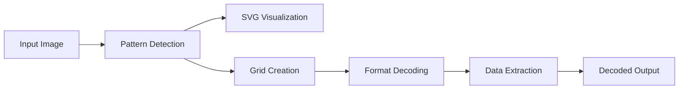

# QR Code Reader & Decoder

## Overview
A Python-based QR code processing system that analyzes images, detects structural patterns, and decodes contained data. Generates visual annotations while supporting numeric, alphanumeric, and binary data extraction.

The following images are based on this QR Code, which has the text 'hello world' embedded within it:


## Features

- **Pattern Detection**  
   - Automatically identifies finder patterns (corners), timing patterns (alignment lines), and version/format information.

- **Visual Debugging** - Generates layered SVG outputs showing:
  - Original QR code
  - Finder patterns (blue)
  - Timing patterns (gold)
  - Decoding path (color-coded)
  - Format/version info areas

  

- **Data Decoding** - Supports:
  - Numeric, alphanumeric, and 8-bit byte encoding
  - Error correction levels (L, M, Q, H)
  - Versions 1-10+ (auto-detected)
  - Mask pattern reversal
  - This is the unmasked QR code:
  
  

- **Intelligent Processing**  
   - Dynamically calculates block sizes and handles orientation variations.

## Requirements

- Python 3.8+
- `Pillow` library:
  ```bash
  pip install Pillow
  ```

## Usage

1. **Basic Processing**
   ```bash
   python main.py --input qr_image.png --output analysis.svg
   ```

2. **Output Interpretation**
   - Open the resulting SVG in any modern browser
   - Gold rectangles = Timing patterns
   - Blue regions = Finder patterns
   - Purple/green = Format/version info
   - Colored blocks = Data decoding sequence

## Sample Workflow



## Supported QR Specifications

| Feature              | Support Level             |
|----------------------|---------------------------|
| Encoding Modes       | Numeric, Alphanumeric, Byte |
| Error Correction     | L (7%), M (15%), Q (25%), H (30%) |
| Version Detection    | 1-10+ (Auto-scaled)       |
| Mask Patterns        | 8 standard types          |

## Limitations

- Static image input only (no camera support)
- Best results with standard QR codes
- Currently does not include any error handling
- Can't adjust the QR Code to its correct orientation

## Development Notes

```bash
.
├── main.py            # Entry point & visualization pipeline
├── parse.py           # Core detection/decoding logic
└── xmlpy.py           # SVG generation utilities
```

## License
Open-source under MIT License. Commercial use permitted with attribution.
