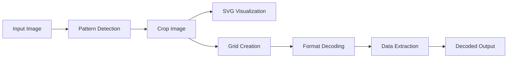

# QR Code Reader & Decoder

## Overview
A Python-based QR code processing system that analyzes and crops images, detects structural patterns, and decodes contained data. Generates visual annotations while supporting numeric, alphanumeric, kanji, binary, and ECI data extraction.

The following images are based on this QR code, which has the text 'hello world' embedded within it:


## Features

- **Pattern Detection**  
   - Automatically identifies finder patterns (corners), timing patterns (alignment lines), and version/format information.
   - After locating the finder patterns, it crops the image to the surrounding area of the QR code.

- **Visual Debugging** - Generates layered SVG outputs showing:
  - Original QR code
  - Timing patterns (gold)
  - Decoding path (color-coded)
  - Format/version info areas

  

- **Data Decoding** - Supports:
  - Numeric, alphanumeric, kanji, ECI, and 8-bit byte encoding
  - Error correction levels (L, M, Q, H)
  - Versions 1-40 (auto-detected)
  - Mask pattern reversal
  - This is the unmasked QR data and error correction bits:
  
  

- **Intelligent Processing**  
   - Dynamically calculates block sizes and handles orientation variations.
   - Rotates and crops the image based on the finder pattern positions

## Requirements

- Python 3.8+
- `Pillow` library:

  ```bash
  pip install Pillow
  ```

## Usage

1. **Basic Processing**
   ```bash
   python main.py --input qr_image.png --output analysis.svg
   ```

2. **Output Interpretation**
   - Open the resulting SVG in any modern browser
   - Gold rectangles = Timing patterns
   - Purple/Green rectangles = Format info
   - Orange rectangles = Alignment patterns
   - Colored blocks = Data decoding sequence

## Sample Workflow


```mermaid
graph LR
A[Input Image] --> B[Pattern Detection]
B --> C[Crop Image]
C --> D[SVG Visualization]
C --> E[Grid Creation]
E --> F[Format Decoding]
F --> G[Data Extraction]
G --> H[Decoded Output]
```

## Supported QR Specifications

| Feature              | Support Level             |
|----------------------|---------------------------|
| Encoding Modes       | Numeric, Alphanumeric, Byte, Kanji, ECI |
| Error Correction     | L (7%), M (15%), Q (25%), H (30%) |
| Version Detection    | 1-40 (Auto-scaled)       |
| Mask Patterns        | 8 standard types          |

## Limitations

- Static image input only (no camera support)
- Currently does not include any error handling

## Development Notes

```bash
.
├── main.py            # Entry point & visualization pipeline
├── parse.py           # Core detection/decoding logic
└── xmlpy.py           # SVG generation utilities
```

## License
Open-source under MIT License. Commercial use permitted with attribution.
